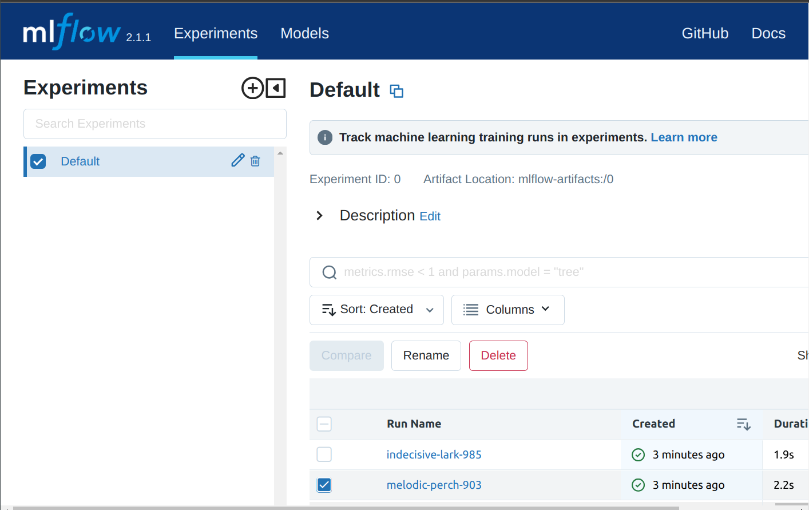
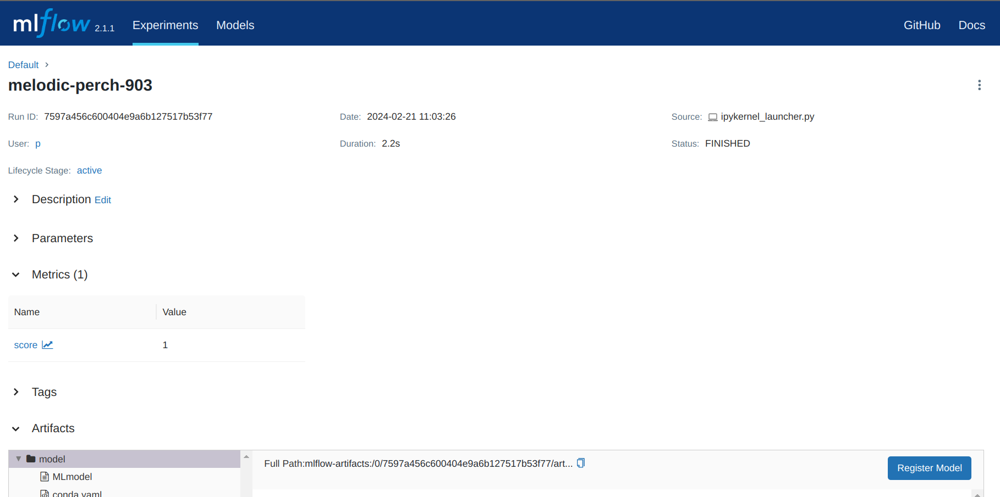
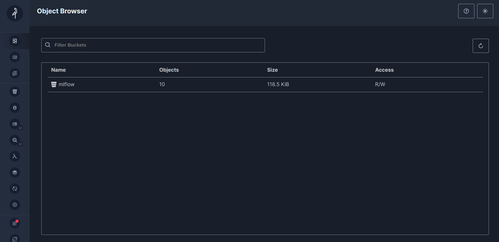
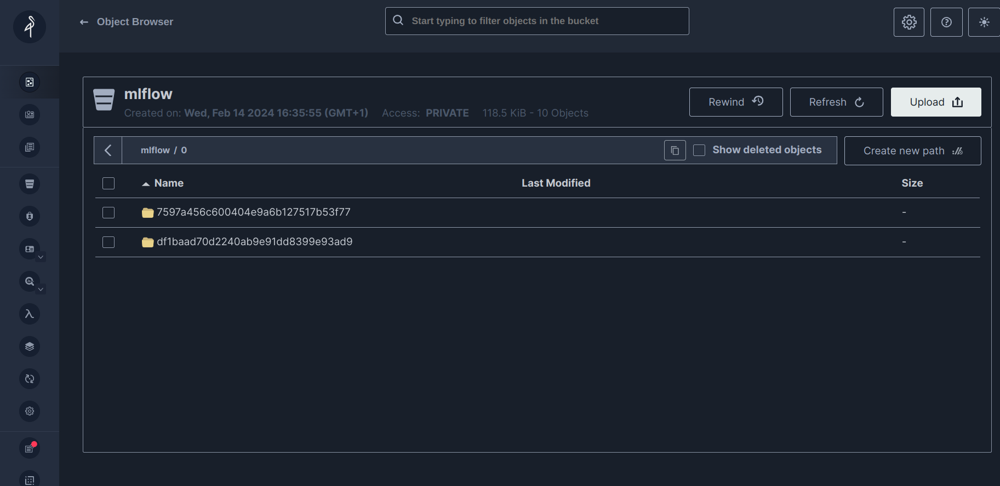
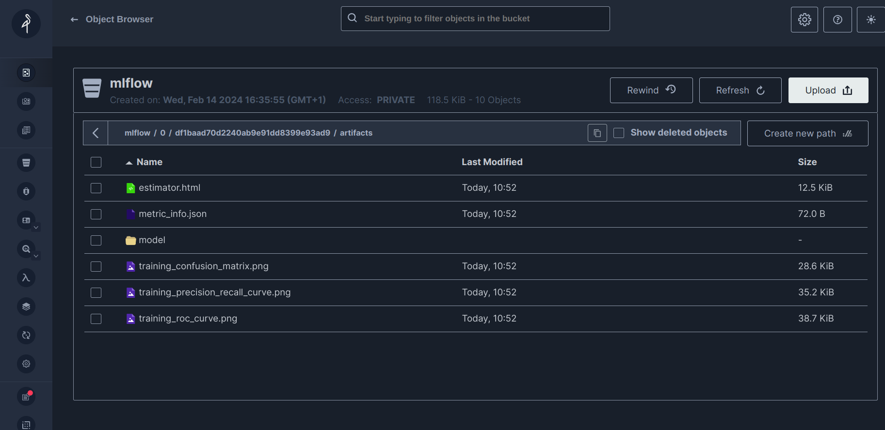

# Mlflow + MinIo installation on K8s

To deploy Mlflow alongside with MinIo on minikube cluster in your localhost follow steps bellow:
## Minio deployment

1- Start minikube cluster
```python
minikube start 
```

2- create a namespace using kubectl on your terminal


```python
NAMESPACE_NAME=test # you can replace it with your name
kubectl create namespace "$NAMESPACE_NAME"
```


3- Apply minio on cluster
```python
kubectl -n "$NAMESPACE_NAME" create -f minio-install.yaml 
```


4- Check the resources in the namespace
```python
kubectl -n "$NAMESPACE_NAME" get all
```

5- Access minio on a browser
```python
pod_name=$(kubectl get po -n test | grep minio | awk '{print $1}' | xargs -I {} kubectl get pod {} -n test -o jsonpath='{.metadata.name}')
kubectl port-forward $pod_name 9000 9090 -n "$NAMESPACE_NAME"
```

6- Kill the process if it's reqiured:
```python
sudo kill -9 `sudo lsof -t -i:9090`
```

> Notice: You may need to create a bucket and call it `mlflow` from **MinIo Console** or using [`test.ipynb`](test.ipynb)


## MLFLOW deployment

1- Apply `mlflow-install.yaml` on cluster
```python
NAMESPACE_NAME=test
kubectl -n "$NAMESPACE_NAME" create -f mlflow-install.yaml 
```

2- Check the resources in the namespace
```python
kubectl -n "$NAMESPACE_NAME" get all
```

3- Access mlflow on a browser
```python
pod_name=$(kubectl get po -n test | grep mlflow | awk '{print $1}' | xargs -I {} kubectl get pod {} -n test -o jsonpath='{.metadata.name}')
kubectl port-forward $pod_name 5000:5000 -n "$NAMESPACE_NAME"
```


4- Test Mlflow using [`test.ipynb`](test.ipynb):

- Different runs on Mlflow UI:

- Overview of the selected run:


- Check artifacts on Minio
  - image 1:
  
  - image 2:
  
  - image 3:
  

5- Kill the process if it's reqiured:
```python
sudo kill -9 `sudo lsof -t -i:5000`
```